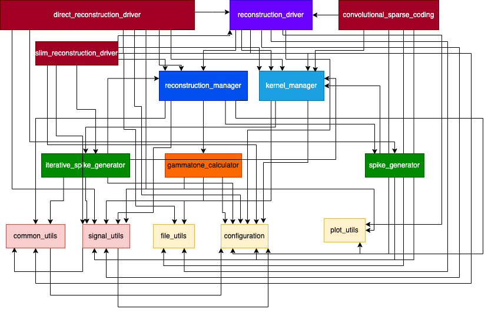

# LocallyOptimalSpiking

This project implements a framework for encoding continuous time signals using spiking neurons.

## Project Overview

1. **Module Descriptions**
    - Brief descriptions of the various modules in the project, highlighting their functionalities.

2. **Running the Project**
    - Instructions on how to run the project in different modes.

3. **Parameter Table**
    - A table detailing the important parameters of the proposed model.

4. **Licensing and Authorship**
    - Information about the licensing terms and authorship.

## Module Descriptions

The following diagram shows the dependencies between different modules in the project:

Key modules are briefly described below.
- **direct_reconstruction_driver:** Main module that provides the interface for running the large scale experiments over large number of audio snippets by systematically varying the model parameter and generates the statistics of the whole experiment. The module overrides the default parameter set in the configuration file with a range of parameter values set inline. 
- **reconstruction_driver:** Module that provides interface for processing a single audio snippet by its index from the repository of audio snippets, inputted as text files. 
- **reconstruction_manager:** Module that provides an interface for orchestrating the whole processing of coding and reconstruction for a given input signal with a given set of kernels. The module achieves this task by exposing a bunch apis that centralize the process of signal kernel convolutions, invokes the spike generator and finally reconstructs the signal iteratively or in batch-mode (depending on the mode of execution), generate statistics and so on.
- **gammatone_calculator:** Computes gammatone kernels for 1D audio signal processing. Kernels correspond to frequencies evenly spaced on the ERB scale, with 5,000 center frequencies listed in 'frequencies_5000.txt'. 
This module supports both compressed (using coefficients of shifted B-splines) and uncompressed kernel calculations. The compressed form can speed up inner product computations, especially when learning coefficients for experimentation.
- **kernel_manager:** Sits above the concrete kernel generator modules (e.g., gammatone_calculator). It initializes the framework with the required number of kernels and provides an interface for functionalities like computing inner products between kernels. See inline documentation for details.
- **spike_generator:** Concrete implementation module for generating spikes, given an input signal and the set of kernels, using a simple convolve and threshold scheme. 
- **configuration:** Configuration file that stores the initial values of parameters used in the project.
- **common_utils:** Module that provides common utility methods for the projects supporting operations, e.g. matrix operations, interpolation etc.
- **signal_utils:** Module that provides utility methods supporting several operations on the input/ output or convolution signals. Operations include calculating norm, upsample, calculating convolution, etc.
- **plot_utils:** Utility module that provides several plotting functionalities used for visualization purposes.
- **convolutional_sparse_coding:** This module leverages the state of the art convolutional sparse coding techniques from the sporco package runs large scale experiments on repository of audio signal with a given set kernels similar to direct_reconstruction_driver. In this case, the parameters of cbpdn are systematically varied to achieved reconstructions are different spike rates and the values of the parameters can be found inline.

## Running the Project

To use this project, follow these steps:

1. Step 1
2. Step 2
3. Step 3

## Parameter Table

1. Step 1
2. Step 2
3. Step 3

## License

This work is licensed under a [Creative Commons Attribution-NonCommercial-NoDerivs 4.0 International License](http://creativecommons.org/licenses/by-nc-nd/4.0/).

**Important Note**: This project is also subject to a provisional patent. The Creative Commons license applies to the documentation and code provided herein, but does not grant any rights to the patented invention.

## Authors

- Anik Chattopadhyay (https://github.com/crystalonix) - Initial work
